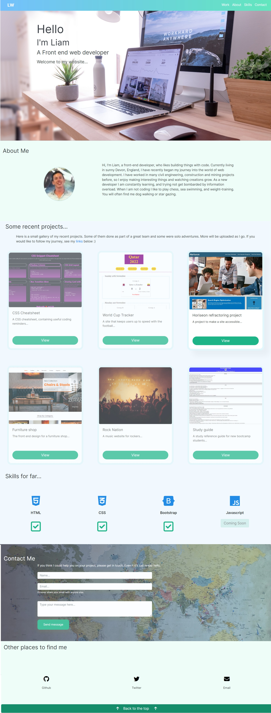

## Bootstrap-portfolio

A portfolio made with bootstrap components

## Usage

This repo contains a new portfolio website. It was built using bootstrap 4, and adding my own css styles. It showcases my most recent work and will be updated, as I progress throughout the course.

- It contains my name, a picture, and a form where users can message me, and it I will receive it on my email.
- For each project, a modal appears with more details about each one.
- It also contains a wireframe, of the project.

I've expermented a lot with linear gradients, and different hover effects/animations.

## Wireframe

I designed this basic [wireframe](./assets/wireframe/portfolio-wireframe.pdf) before I started writing any code. I found this exteremely helpful, for limiting a infinate amount of design desicions. For my next website, I am going to write all my design choices, on a wireframe before I start. It really gives me focus.  
The only thing I didn't do, was add an image to the project modals. the reason for this, is that for these particular projects, I found I was only repeating the screenshots on the cards.
Thinking about user experience, it might not be good seeing each image twice. For other projects, when I get more images, I might do this.
Other than that, I think the website looks very similar to the wireframe.

## Contact form

In this section, I wanted to connect a form to my email address. After a little research I found https://formsubmit.co/, which links the form to my email. Note: there is a way of blocking an email address in the html document, but I have not done this, as think it is good for people to know my email address on a portfolio website.

## Screenshot

## The website

This site can be found at https://liamjameswatson.github.io/bootstrap-portfolio/

## License

MIT License (Please refer to LICENSE in the repo.)
