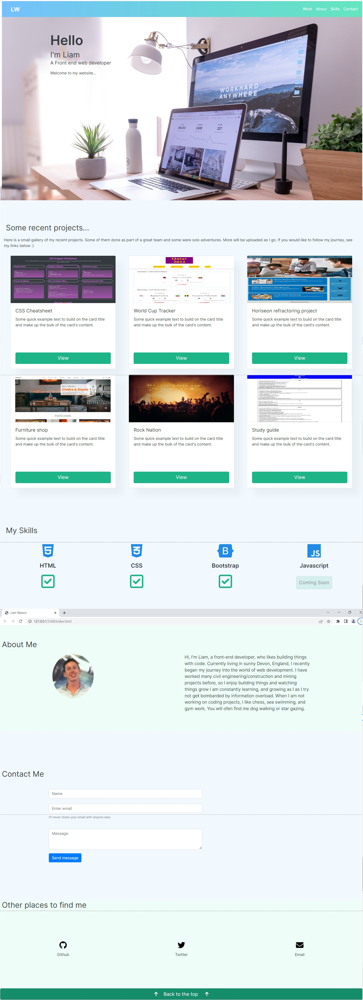

## Bootstrap-portfolio

A portfolio made with bootstrap components

## Usage

This repo contains a new portfolio website. It was built using bootstrap, and adding my own css styles. It showcases my most recent work and will be updated, as I progress throughout the course.

- It contains my name, a picture, and a form where users can message me, and it I will receive it on my email.
- For each project, a modal appears with more details about each one.
  -It also contains a wireframe, of the project.

## Screenshot

## The website

This site can be found at https://liamjameswatson.github.io/bootstrap-portfolio/

## License

MIT License (Please refer to LICENSE in the repo.)
